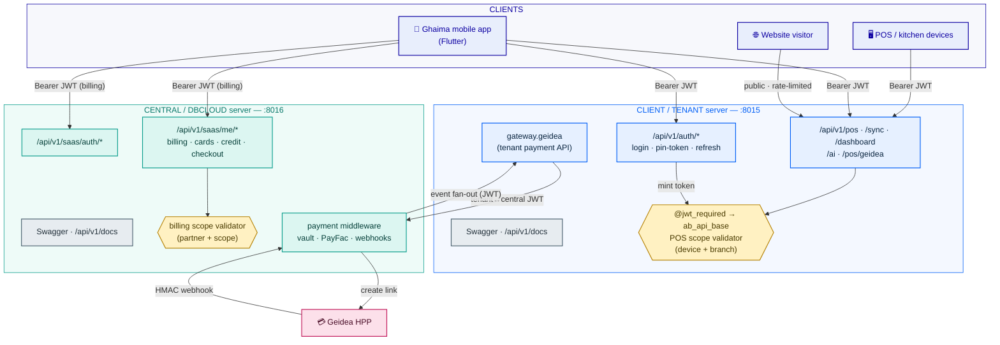
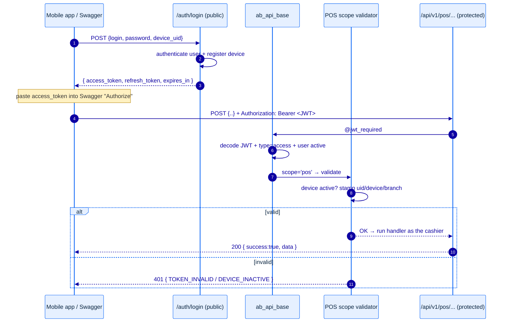
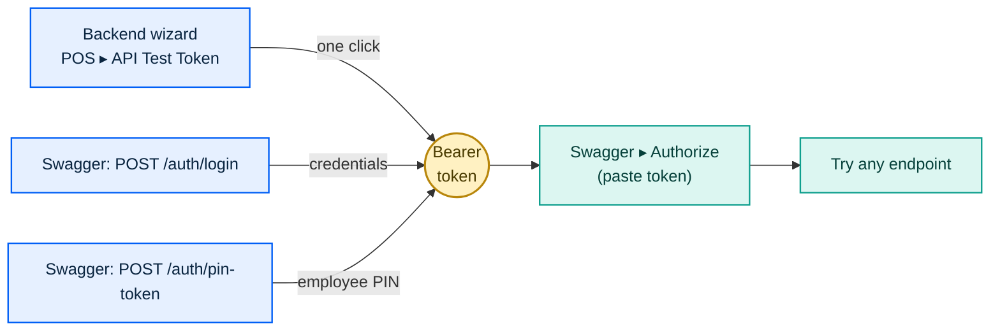

# Ghaima APIs — Architecture & Flow

How the unified API works across the **client (tenant)** and **central (DBCLOUD)**
servers: one token system, one decorator seam (`ab_api_base`), auto-generated
Swagger on each server.

- Rendering: Mermaid (GitHub / VS Code Mermaid preview render these directly).
- Palette (Ghaima tokens): client = blue `#005FF6` / navy `#0D00A2`,
  central = teal `#0E9F8E` / cyan `#5DD8CA`, scope-guard = amber, external = rose,
  docs = slate. Dark text on light tints (WCAG-AA contrast).
- Token: HS256 JWT signed with `ir.config_parameter` key `mobile_api.jwt_secret`;
  claims `uid, device_id, branch_id, type='access', scope`.

**Legend** — 🟦 client · 🟩 central server · 🟨 scope validator · 🟥 external provider · ⬜ Swagger docs

---

## 1. System map — who talks to what

**Key idea:** `ab_api_base` installs on *both* servers. Its Swagger builds the
spec from **that server's own routing map**, so the tenant docs show tenant APIs
(115 paths) and the central docs show central APIs (52 paths) — one module, no
per-server config.

---

## 2. Getting a token & calling an endpoint (the auth loop)

**Scope-gating:** every token is decoded by the same seam, but the scope
validator decides acceptance. A POS token (has `device_id`) is rejected by
billing endpoints; a billing token (`scope=saas_billing`, no device) is rejected
by POS endpoints — even though both are signed with the same secret. "One token
system" never means "one key opens every door".

---

## 3. Three ways to get a token to test

---

## 4. How the docs describe each endpoint

`ab_api_base` builds each endpoint's OpenAPI entry from, in priority order:

1. **`register_doc(path, summary, description, request_example, response_example)`**
   — explicit, hand-written docs (most precise).
2. **Handler docstring** — auto-extracted as summary/description.
3. **Handler source** — body params auto-extracted from
   `data.get()/body.get()/kwargs.get()` so "Try it out" shows the fields.

Auth mode per route: `token` (Bearer) unless the path is public
(login / pin-token / refresh / webhooks / simulator), shown without `bearerAuth`.
