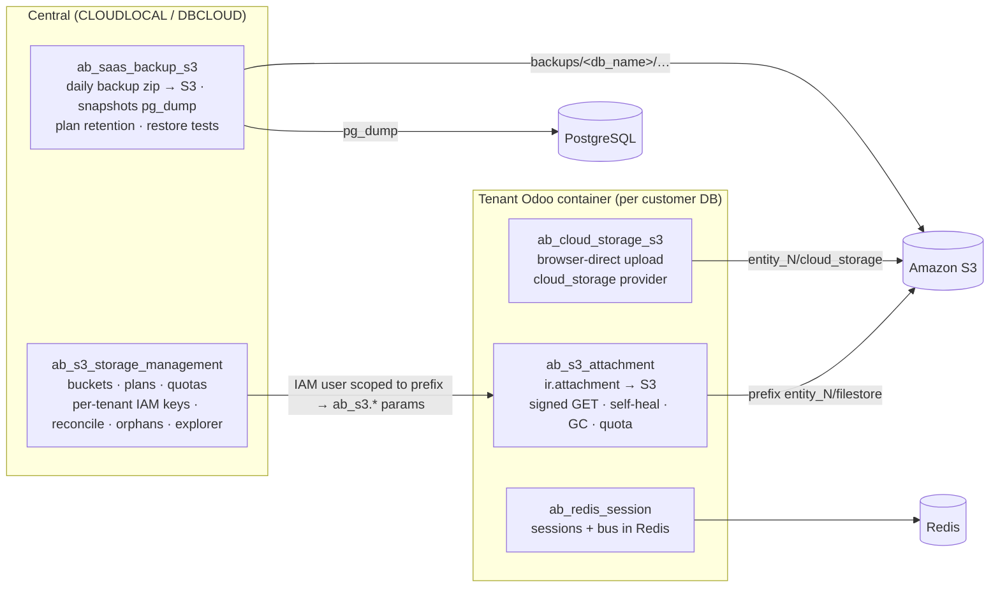
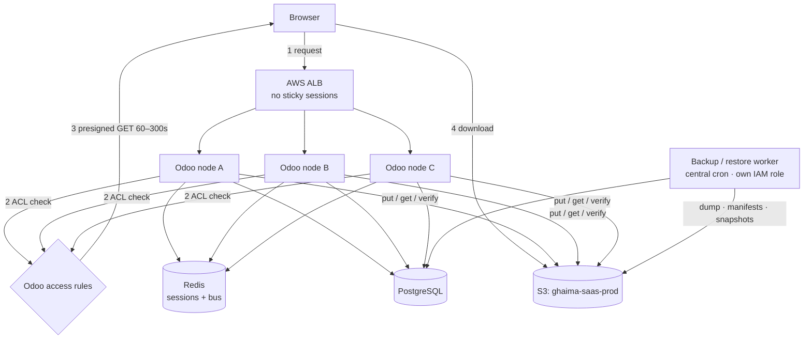

# Ghaima SaaS — S3 Storage, Backup & Recovery Plan

> **Status:** Plan only — nothing in this document is implemented yet.
> **Source requirements:** [`S3_REQUIREMENTS_SPEC.md`](S3_REQUIREMENTS_SPEC.md)
> **Owner module:** `ab_s3_attachment` (saas-share) · **Date:** 2026-10-04 · **Target:** Odoo 18, multi-node, AWS

---

## 1. Executive summary

The platform already has most of the parts: the S3 filestore (`ab_s3_attachment`), browser-direct uploads (`ab_cloud_storage_s3`), Redis sessions (`ab_redis_session`), bucket, quota and IAM management (`ab_s3_storage_management`), and backups, snapshots, retention and restore tests (`ab_saas_backup_s3`).

What's missing is the **glue that makes them one recoverable system**:

| # | Critical gap | Why it matters |
|---|---|---|
| G1 | **Filestore GC ignores snapshots and backups.** `_gc_s3_file_store` checks only the live DB. | Restoring an older snapshot can find its attachments deleted. This is a data-loss path. |
| G2 | **Snapshots are DB-only** (`s3_snapshot._dump_db_to_s3`) and have no filestore manifest. | A snapshot is not a full tenant state. |
| G3 | **Storage identity is the DB name.** Backup keys are `backups/<database_name>/…`. | A DB rename breaks the lineage, and customer names leak into keys. |
| G4 | **Backups have no manifest or SHA-256 verification state machine.** | "pg_dump OK" is treated as backup OK. |
| G5 | **No distributed locks** on backup, snapshot or migration per tenant. | On multiple nodes, two crons can run the same job twice. |
| G6 | **SSE-S3 (AES256) is hard-coded** and SSE-KMS is not configurable. | Fails the encryption-config requirement. |
| G7 | **`s3_url` builds a public-style URL**: `https://<bucket>.s3.amazonaws.com/<key>`. | It must only ever be a presigned link given after an access check. |
| G8 | **There is no health service, structured operation log or alerting layer.** | S3 failures stay invisible until a user complains. |

**Strategy:** extend the existing modules in place. Add only **two** new addons:
- `ab_s3_core`: a shared service layer;
- `ab_s3_backup_manifest`: manifests, GC protection and snapshot-v2, a bridge on `ab_saas_backup_s3`.

---

## 2. Current-state map (what exists today)



| Capability | Where it lives today | State |
|---|---|---|
| Filestore read/write/delete on S3 | `ab_s3_attachment/models/ir_attachment.py` (`_file_read/_file_write/_file_delete`) | ✅ Working |
| Dedup (checksum = fname) | `_s3_dedup_skip_write` | ✅ Working (fname is SHA-1, Odoo-native) |
| Signed download after ACL | `_s3_can_redirect`, `_s3_signed_stream` (`ab_s3.signed_urls`, off by default) | ✅ Working, ⚠️ off by default |
| Self-heal missing object | `_s3_heal_upload`, `_cron_s3_self_check` | ✅ Working (cron inactive) |
| Local → S3 migration | `s3_migrate_local_to_s3` | ⚠️ No dry-run, resume, verify or progress |
| GC | `_gc_s3_file_store` | ❌ Not snapshot-aware (G1) |
| Quota | `_check_s3_quota`, `ab_s3.max_storage_bytes` | ✅ Working |
| Tenant isolation | Per-tenant IAM user locked to `bucket/prefix/*` (`s3_tenant_credentials`) | ✅ Strong; ⚠️ static keys, not roles |
| Sessions | `ab_redis_session` (`ab_redis.url/prefix/session_ttl`) | ✅ Right design; no `local`/`s3` switch |
| Backups | `ab_saas_backup_s3` zip (dump + `filestore/`) → `backups/<db_name>/` | ⚠️ No manifest/SHA-256/state machine (G3, G4) |
| Snapshots | `s3_snapshot.py` streaming `pg_dump -Fc` → S3 | ⚠️ DB-only (G2) |
| Retention | `plan_retention.py` (daily/weekly/monthly/keep_min, snapshot max age) | ✅ Good logic; ⚠️ not linked to GC |
| Restore tests | `restore_test.py` | ✅ Exists; ⚠️ only counts files in the zip |
| Reconcile / orphans | `s3_reconcile_report`, `s3_orphan_prefix`, `s3_backup_orphan` | ✅ Exists (central side) |
| Encryption | Hard-coded `AES256` | ⚠️ G6 |
| Health / alerts / op log | — | ❌ G8 |

---

## 3. Target architecture



### 3.1 Bucket layout (keyed on an immutable `storage_uuid`, never the DB name)

```
ghaima-saas-prod/
├── tenants/<storage_uuid>/
│   ├── filestore/<sha1[:2]>/<sha1>          ← content-addressed (Odoo fname), immutable
│   ├── cloud_storage/…                      ← ab_cloud_storage_s3 (browser uploads)
│   └── metadata/tenant.json
├── backups/
│   ├── postgres/<storage_uuid>/<YYYY>/<MM>/<DD>/<backup_id>.dump
│   └── manifests/<storage_uuid>/<backup_id>.json
├── snapshots/<storage_uuid>/<snapshot_id>/{database.dump, manifest.json, metadata.json}
├── staging/uploads/<storage_uuid>/<upload_id>   ← lifecycle: expire 2 days
└── healthcheck/<instance>/<uuid>                ← lifecycle: expire 1 day
```

**Compatibility:** existing `entity_<id>/filestore` prefixes keep working. `storage_uuid` maps to the legacy prefix, so renaming storage is a **metadata** change, not an object copy, until the optional Phase 4b re-key.

### 3.2 Consistency model (chosen: content-addressed + manifest + deletion grace)

Odoo filestore objects are **immutable and content-addressed**: fname = SHA-1 of the content. Because of that:

1. **Snapshot = `pg_dump` (MVCC-consistent) + manifest generated _from that dump's own `ir_attachment.store_fname` set`.** We do not list S3; the manifest is derived from the snapshot's DB state.
2. **No object in any retained manifest may be deleted.** GC enforces this (G1 fix).
3. **Deletion grace period**, 7 days by default: Odoo's `_file_delete` only marks; GC removes objects only after the grace period *and* when no manifest references them.

| Race during backup | Outcome |
|---|---|
| Upload during backup | The new row is not in the dump, so it's not in the manifest; the object is kept anyway. ✅ |
| Delete during backup | The row is in the dump, so it's in the manifest, so it's protected from GC. ✅ |
| Update (new content) | The new fname is a new object. The old fname stays protected by the manifest. ✅ |
| Transaction rollback | The object was written but no row exists. It becomes an orphan and is removed after the grace period. ✅ |
| Worker crash mid-upload | Multipart is aborted by lifecycle; no row exists. ✅ |
| Dump OK, manifest fails | The backup stays `VERIFYING → FAILED` and is never `COMPLETED`. Retry. ✅ |

---

## 4. Requirement → implementation mapping

Legend: **Reuse** = already done · **Extend** = change an existing module · **New** = new code

| Spec area | Decision | Module / file | Step |
|---|---|---|---|
| Audit report | New doc | `docs/S3_SAAS_ARCHITECTURE_AUDIT.md` | P1 |
| S3 client, retries, SSE-KMS, timeouts | **New** `S3ClientService` | `ab_s3_core/services/client.py` | P2 |
| Health check (HEALTHY/DEGRADED/FAILED) | **New** `S3HealthService` + `s3.health.check` model | `ab_s3_core` | P2 |
| Structured op log | **New** `s3.operation` model (tenant, op, bytes, files, retries, error) | `ab_s3_core` | P2 |
| Distributed locks | **New** `pg_try_advisory_xact_lock(hash('s3_backup:'+uuid))` helper | `ab_s3_core/services/lock.py` | P2 |
| Filestore CRUD and checksum | **Reuse/Extend** `_file_write` adds a SHA-256 metadata tag and a post-PUT size check | `ab_s3_attachment` | P3 |
| Presigned download | **Reuse** `_s3_signed_stream`; default `ab_s3.signed_urls=True` after QA; add `ResponseContentDisposition` | `ab_s3_attachment` | P3 |
| Remove public URL | **Extend**: drop `s3_url` and use `_get_s3_presigned_url` only | `ab_saas_backup_s3/models/odoo_entity_backup.py` | P3 |
| Immutable storage ID | **Extend** `storage_uuid` on `odoo.entity` and `s3.storage.quota`, pushed as `ab_s3.storage_uuid` | `ab_s3_storage_management` | P3 |
| Migration CLI | **Extend** `s3_migrate_local_to_s3` into `S3MigrationService` (dry-run, resume via `s3.migration.state`, verify, batch, workers); plus an `odoo-bin s3 migrate` command | `ab_s3_attachment/cli/` | P4 |
| Backup manifest and state machine | **New** `backup_state` (STARTED…DELETED), `manifest_key`, `sha256` fields on `odoo.entity.backup` | `ab_s3_backup_manifest` | P5 |
| Snapshot v2 (DB + filestore manifest) | **Extend** `_dump_db_to_s3` + `_build_manifest_from_dump()` | `ab_s3_backup_manifest` | P6 |
| Retention config | **Reuse** `plan_retention.py`; add a per-tenant override and deletion-grace fields | `ab_saas_backup_s3` | P6 |
| Sessions | **Reuse** Redis; add a `session_backend` switch (redis/local) and document why S3 is rejected | `ab_redis_session` | P7 |
| Reference-aware GC | **Extend** `_gc_s3_file_store` so it asks central for the protected-fname set (manifest union), with dry-run and report | `ab_s3_attachment` + `ab_s3_backup_manifest` | P8 |
| Restore + verification | **Extend** `restore_test.py`: manifest verify, object count, checksums, login and attachment probe; generates `RESTORE_VERIFICATION.md` | `ab_saas_backup_s3` | P9 |
| Tenant deletion lifecycle | **Extend** the entity states ACTIVE → SUSPENDED → DELETION_PENDING → DELETED, gated by retention | `ab_s3_storage_management` | P9 |
| Admin UI and dashboard | **Extend** the existing S3 menus and the cockpit; add a tenant storage health tab | `ab_s3_storage_management`, `ab_saas_cockpit` | P10 |
| Alerts | **New** cron rules on `s3.operation` / `s3.health.check` sent to mail activity and Prometheus (`ab_saas_monitor`) | `ab_s3_core` | P10 |
| IAM policy | **New** doc: runtime / backup / restore / admin roles, no `s3:*` | `docs/aws-iam-policy.json` | P2 |
| Lifecycle, versioning, Object Lock | **Extend** `s3_storage_bucket` provisioning to apply rules (§6) | `ab_s3_storage_management` | P2 |

---

## 5. Implementation plan (phased, gated)

Every phase ships with:
- an `ar.po` update (KSA Arabic);
- tests under `tests/` that use the existing `fake_s3.py`, with LocalStack for integration;
- **no production data changes** until its exit criteria pass.

### Phase 1: Audit (docs only)
1. Write `S3_SAAS_ARCHITECTURE_AUDIT.md`, expanding §2 with line references.
2. List every persistent file path that does not go through `ir.attachment`:
   - wkhtmltopdf temp files;
   - `ir.asset` bundles;
   - the session dir;
   - `data_dir/addons`;
   - import temp files.
3. **Exit:** risks G1–G8 confirmed or rejected with evidence; no code changed.

### Phase 2: Core service layer (`ab_s3_core`, new, depends `base`)
1. `S3ClientService`:
   - boto3 `Config` with standard retries (adaptive mode, max attempts from config) and connect/read timeouts;
   - SSE-S3 or SSE-KMS, chosen by `ab_s3.encryption` and `ab_s3.kms_key_id`;
   - `S3_ENDPOINT_URL` for LocalStack.
2. Error classifier: *retryable* errors (throttle, 5xx, timeout, reset) vs *permanent* ones (AccessDenied, NoSuchBucket, InvalidAccessKeyId). Backoff with jitter, retries capped.
3. `S3HealthService`: put, get, SHA-256 compare, then delete under `healthcheck/<instance>/<uuid>`. Writes a `s3.health.check` row.
4. `s3.operation` model and a JSON log formatter that never logs secrets.
5. `lock.py`: Postgres advisory locks (multi-node safe), keyed on `s3_backup|s3_snapshot|s3_migration:<uuid>`.
6. Refactor `ab_s3_attachment` and `ab_saas_backup_s3` to use `ab_s3_core`. Their public behaviour does not change.
7. **Exit:** health check passes against real S3 and LocalStack; a KMS-encrypted put is verified.

### Phase 3: Filestore hardening
1. Write path: compute SHA-256 → `put_object(ChecksumAlgorithm='SHA256')` → check `ContentLength` → return. An S3 failure raises, which rolls back the transaction, so there is no row without an object.
2. Never silently fall back to local disk when S3 is down. Today's local fallback is kept **read-only** for self-heal.
3. `storage_uuid`: generate it on the entity, map it to the legacy prefix, and push `ab_s3.storage_uuid`.
4. Turn on signed downloads by default. Set `ResponseContentDisposition` and `ResponseContentType`. Keep the proxy path for assets, wkhtmltopdf and resized images (already done).
5. Remove `s3_url` (G7).
6. **Exit:** CRUD, isolation (tenant A's key → tenant B's prefix returns 403) and signed-URL expiry tests are green.

### Phase 4: Migration
1. Run `odoo-bin s3 migrate --database <db> [--dry-run] [--verify] [--resume] [--batch-size N] [--max-workers N] [--keep-local|--delete-local]`.
2. Table `s3.migration.state` (fname, size, sha256, status, attempts) makes runs resumable and idempotent.
3. Progress: total, processed, uploaded, skipped, failed, bytes, %, ETA. It is logged and stored on `s3.operation`.
4. Local files are deleted only with `--delete-local` **and** after the object's verify status is `OK`.
5. **Exit:** stop a migration at 65%, rerun it, and it ends at 100% with no re-uploads.

### Phase 5: Backups v2 (`ab_s3_backup_manifest`, new auto-install bridge on `ab_saas_backup_s3`)
1. State machine on `odoo.entity.backup`: STARTED → UPLOADING → VERIFYING → COMPLETED | FAILED (and later RESTORING, RESTORED, EXPIRED, DELETING, DELETED).
2. Pre-flight checks: free-disk check and PG connectivity.
3. Streaming `pg_dump -Fc`, uploaded as a multipart upload with SHA-256 computed on the stream. Then a `head_object` size check and a checksum compare.
4. Manifest JSON with every field from the spec. Its own SHA-256 is stored on the record.
5. New keys go to `backups/postgres/<uuid>/YYYY/MM/DD/`. Old zips stay readable (`backup_format = 'zip_v1'`).
6. **Exit:**
   - a kill -9 mid-upload leaves the backup FAILED;
   - the multipart upload is aborted;
   - the retry succeeds.

### Phase 6: Snapshots v2 + retention
1. Snapshot = backup v2 + filestore manifest built from the **dumped** `ir_attachment` rows. Use `pg_restore -a -t ir_attachment` into a temp schema, or read them in the same `REPEATABLE READ` transaction as the dump via `--snapshot=<exported id>`.
2. Retention: keep `plan_retention.py` and add:
   - a per-tenant override;
   - `deletion_grace_days`;
   - `retention_class`, `expires_at` on each backup.
3. Expiring a backup sets EXPIRED, then GC handles it. Retention never deletes filestore objects directly.
4. **Exit:** snapshot → delete attachment → snapshot restore brings the attachment back.

### Phase 7: Sessions
1. Keep Redis as the production backend. Add `ab_redis.session_backend = redis|local`.
2. S3 sessions are **rejected** (write amplification, no atomic compare-and-set, LIST cost). This is recorded in the ADR.
3. **Exit:** log in on node A, request through B, log out on C, and the session is invalid everywhere.

### Phase 8: Reference-aware GC
1. Protected set = live `store_fname` + the union of all non-EXPIRED backup and snapshot manifests + objects younger than `deletion_grace_days`.
2. Central exposes `GET /api/v1/saas/s3/protected/<uuid>`, signed with the tenant JWT and cached. The tenant GC calls it, and **pauses if it's unreachable**.
3. `--dry-run` report: inspected / active / snapshot-ref / backup-ref / protected / eligible / bytes reclaimable.
4. **Exit:** the E2E steps 9–11 of the spec pass, and the snapshot's objects survive GC.

### Phase 9: Restore & DR
1. Restore flow (14 steps, spec §RESTORE). It always restores to a **new DB first** and swaps only on explicit confirmation.
2. Extend `restore_test.py` so it checks:
   - login;
   - one image, one PDF and one document attachment;
   - module versions;
   - missing/orphan counts.

   It then writes `RESTORE_VERIFICATION.md`.
3. Tenant deletion lifecycle with retention gating.
4. Failure drills: S3 down, PG down, killed worker, corrupt manifest, two schedulers at once.
5. **Exit:** every drill in the spec recovers. The results are recorded.

### Phase 10: Observability & rollout
1. Dashboard tab on the entity and in the cockpit, showing:
   - last OK and last failed backup;
   - sizes;
   - snapshot count;
   - S3 health;
   - last restore test.
2. Alerts:
   - no successful backup in the window;
   - repeated failures above the threshold;
   - storage growth spikes;
   - orphan growth.

   They are exported to `ab_saas_monitor` metrics.
3. Rollout:
   - staging tenant;
   - 5% of tenants;
   - all tenants.

   Each step has a rollback, which is a flag flip back to v1 paths.
4. Write `S3_IMPLEMENTATION_REPORT.md` and `docs/ARCHITECTURE_DECISIONS.md`.

---

## 6. S3 bucket policy matrix

| Prefix | Versioning | Lifecycle | Object Lock | Encryption |
|---|---|---|---|---|
| `tenants/*/filestore` | Off (content-addressed; app GC decides) | none | ❌ | SSE-KMS |
| `backups/*` | On | noncurrent → 30 d expire; current → Glacier IR after 30 d | Optional (governance) | SSE-KMS |
| `snapshots/*` | On | noncurrent → 30 d | Optional | SSE-KMS |
| `staging/*` | Off | expire 2 d, abort multipart 1 d | ❌ | SSE-KMS |
| `healthcheck/*` | Off | expire 1 d | ❌ | SSE-S3 |
| sessions | **not in S3** (Redis) | — | never | — |

Block Public Access is **on**. The bucket policy denies `aws:SecureTransport=false` and denies unencrypted puts.

## 7. IAM roles (least privilege, no `s3:*`)

| Role | Allowed |
|---|---|
| `ghaima-runtime` (tenant node) | Get/Put/Delete on `tenants/<own uuid>/*` only. This keeps today's per-tenant IAM user model; later it moves to STS session policies. |
| `ghaima-backup` | Put/Get on `backups/*` and `snapshots/*`; Get on `tenants/*` (for verify); `AbortMultipartUpload` |
| `ghaima-restore` | Get on `backups/*` and `snapshots/*`; Put on `tenants/*` |
| `ghaima-admin` | Lifecycle, versioning and policy management; no data read |

## 8. Risk register

| Risk | Likelihood | Impact | Mitigation |
|---|---|---|---|
| GC deletes snapshot-referenced objects (today) | Medium | **Critical** | Until P8: keep `_gc_s3_file_store` disabled on production. Verify the cron is inactive. |
| Re-keying to `storage_uuid` breaks paths | Low | High | Mapping table and no object copy; re-key is optional in P4b |
| Signed URLs on by default break the website or reports | Medium | Medium | The proxy whitelist already exists; QA on staging first |
| KMS cost and throttling at scale | Low | Medium | Use a bucket key (`BucketKeyEnabled`) |
| Two crons on two nodes | High (multi-node) | Medium | Advisory locks in P2 |

## 9. Deliverables checklist

- [ ] `S3_SAAS_ARCHITECTURE_AUDIT.md` (P1)
- [ ] `docs/aws-iam-policy.json` (P2)
- [ ] `docs/S3_ARCHITECTURE.md`, `S3_SECURITY.md`, `S3_DEPLOYMENT.md` (P2–P3)
- [ ] `docs/S3_MIGRATION.md` (P4)
- [ ] `docs/S3_BACKUP_RESTORE.md`, `S3_RETENTION.md` (P5–P6)
- [ ] `docs/S3_DISASTER_RECOVERY.md`, `RESTORE_VERIFICATION.md` (P9)
- [ ] `docs/ARCHITECTURE_DECISIONS.md`, `S3_IMPLEMENTATION_REPORT.md` (P10)

**Effort estimate:** P1 0.5 d · P2 2 d · P3 2 d · P4 2 d · P5 3 d · P6 3 d · P7 0.5 d · P8 2 d · P9 3 d · P10 2 d. That is **~20 dev-days**; P1–P3 and P8 give the biggest safety return first.
